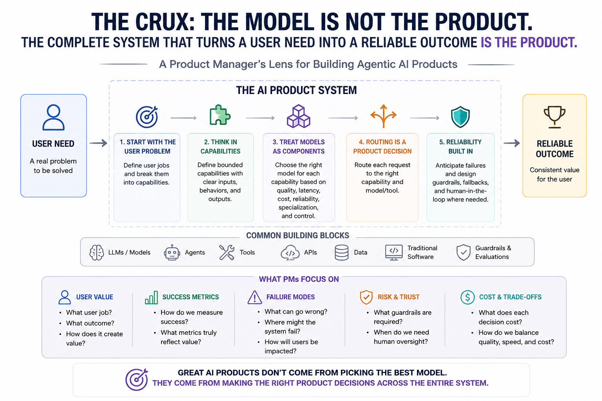

# 1. Building Agentic AI Products: A Product Management Perspective



AI product management is moving beyond the question, **“Which LLM should we use?”**

Modern AI products can combine multiple models, agents, tools, APIs, and traditional software components. A Product Manager does not need to understand every implementation detail, but must understand why these components exist, what user value they create, how success should be measured, and where the system can fail.

The key shift is simple:

> **The model is not the product. The complete system that turns a user need into a reliable outcome is the product.**

## 1. Start With the User Problem, Not the Model

A common mistake in AI product development is starting with technology:

> “Which LLM should we use?”

> “Should we use multiple agents?”

> “Should we fine-tune a model?”

These questions come too early.

Start with the user problem.

For example, users of a financial product might want to:

- Create a budget.
- Analyze an investment.
- Compare investment options.
- Build a diversified portfolio.

These are **user jobs**.

Once the user jobs are clear, break the product into capabilities.
```
Product
   │
   ├── Understand user intent
   ├── Create budgets
   ├── Analyze investments
   ├── Compare options
   └── Construct portfolios
```

The important PM question is:

**What does the user need to accomplish, and what capabilities must the product provide to achieve that outcome?**

Only then should the team decide whether each capability needs an LLM, traditional software, an external tool, or another specialized system.

---

## 2. Think in Capabilities, Not “AI Agents”

It is tempting to describe an AI product as:

> “We are building an intelligent financial agent.”

That sounds impressive but is difficult to evaluate.

A better approach is to define bounded capabilities.

For example:

> Given income and expenses, create a structured monthly budget.

> Given two investments, compare them using defined criteria.

> Given an investment objective, construct a diversified portfolio.

Each capability has a clear input, expected behavior, and output.

This makes it easier to answer:

- What does success mean?
- Which model should handle it?
- Which tools does it need?
- How should we test it?
- What could go wrong?
- How much should it cost?

For PMs, an **agent is better understood as a capability with some decision-making ability**, rather than as a magical autonomous employee.

---

## 3. Treat Models as Components, Not the Product

Different tasks have different requirements.

A simple classification task may need a small, fast model.

A complex reasoning task may need a more capable model.

A highly specialized task may benefit from a domain-specific or fine-tuned model.

Therefore, instead of asking:

> **“What is the best LLM?”**

ask:

> **“What is the best model for this capability?”**

Evaluate model choices across several dimensions:

| Dimension | PM Question |
| --- | --- |
| Quality              | Is the output good enough?                     |
| Latency              | How long does the user wait?                   |
| Cost                 | What does each task cost?                      |
| Reliability          | How consistently does it work?                 |
| Specialization       | Is it particularly good at this task?          |
| Control              | Do we need fine-tuning or hosting flexibility? |

There may be no universally best model.

The right model is the one that provides the right **quality × speed × cost × reliability** trade-off for the specific user job.

---

## 4. Routing Becomes a Product Decision

If a product uses multiple models, tools, or specialized capabilities, it needs to decide where each request should go.

This is **routing**.
```
User Request
      ↓
Understand intent
      ↓
Estimate complexity
      ↓
Choose capability
      ↓
Choose model/tool
      ↓
Execute
      ↓
Return result
```

For example:
```
Simple question
      ↓
Fast / inexpensive model

Complex reasoning
      ↓
More capable model

Specialized task
      ↓
Domain-specific model/tool
```

This can improve both user experience and unit economics.

But routing introduces another potential failure.

If the product has an excellent specialist model but sends the wrong requests to it, overall product quality can still be poor.

PMs should therefore ask:

- What determines the route?
- How accurate is routing?
- What happens when the system is uncertain?
- What is the fallback?
- Does routing improve latency?
- How much does routing reduce cost?
- Does cheaper routing reduce quality?

Routing itself should be treated as a product capability and evaluated accordingly.

---

## 5. AI Products Need a Different Analytics Layer

Traditional product analytics typically tells you what the user did:
```
User opened feature
      ↓
Clicked
      ↓
Completed flow
      ↓
Converted
```

AI products introduce an important layer between user action and product outcome.
```
User request
      ↓
Intent detected
      ↓
Capability selected
      ↓
Model selected
      ↓
Tools called
      ↓
Response generated
      ↓
User outcome
```

A PM should be able to understand this internal journey.

Useful questions include:

- Which capability handled the request?
- Which model was selected?
- Which tools were called?
- How many model calls occurred?
- How many tokens were consumed?
- How long did each step take?
- Where did the request fail?
- What did the interaction cost?
- Did the user ultimately succeed?

This is where **observability** becomes important.

---

## 6. Observability Is Product Analytics for the AI System

Observability answers:

> **What happened inside the system?**

Imagine a user reports:

> “The AI took forever and gave me a bad answer.”

Traditional analytics might show that the user submitted a prompt and received a response.

That is not enough.

You may need to understand:
```
Request
   ↓
Router: 0.5 sec
   ↓
Model A: 2 sec
   ↓
Tool call: 1 sec
   ↓
Model B: 12 sec
   ↓
Final response
```

Now you know where the latency came from.

The same applies to cost and failures.

A mature AI product should provide enough visibility to understand what happened from the original request to the final response.

Without observability, the system becomes a black box.

When quality, latency, or cost suddenly changes, the team struggles to explain why.

---

## 7. Evaluation and Observability Are Different

These two concepts are often confused.

**Observability asks:**

> What happened?

**Evaluation asks:**

> Was the result good?

Suppose the system reports:
```
Correct capability selected
Model successfully called
2,800 tokens consumed
Response generated in 8 seconds
No technical errors
```

Technically, everything worked.

But the answer could still be wrong.

That is why AI products need evaluation.

A useful evaluation set might contain:
```
Normal requests
Complex requests
Ambiguous requests
Edge cases
Failure scenarios
Adversarial inputs
```

Depending on the product, evaluate:

- Correctness.
- Relevance.
- Task completion.
- Routing accuracy.
- Tool-selection accuracy.
- Completeness.
- Safety.
- User satisfaction.

The relationship is:
```
OBSERVABILITY
"What happened?"
       +
EVALUATION
"Was it good?"
       ↓
Understanding AI product performance
```

You need both.

---

## 8. Cost Becomes a Product Metric

One user interaction does not necessarily equal one model call.

An agentic workflow might look like:
```
User request
      ↓
Routing model
      ↓
Specialized agent
      ↓
Tool call
      ↓
Another model call
      ↓
Final response
```

From the user's perspective, this is one interaction.

From the company's perspective, it may involve several paid operations.

AI PMs therefore need to understand operational metrics such as:

- Cost per request.
- Tokens per request.
- Model calls per request.
- Cost by capability.
- Latency by capability.
- Retry rate.
- Failure rate.
- Cost per successful task.

The last metric is particularly important.

Consider:
```
Model A
Cost per attempt: ₹1
Success rate: 60%

Model B
Cost per attempt: ₹2
Success rate: 95%
```

Choosing Model A simply because it is cheaper may be a mistake.

Failures create hidden costs:
```
Failure
   ↓
Retry
   ↓
Higher total inference cost
   ↓
User frustration
   ↓
Possible abandonment
```

Therefore, a stronger PM metric is:

> **Cost per successful user outcome**

rather than simply:

> **Cost per model call**

---

## 9. Reliability Gets Harder With Agentic Systems

Traditional software is often relatively deterministic:
```
Input
  ↓
Defined logic
  ↓
Predictable output
```

An agentic system can involve multiple decisions:
```
User request
      ↓
Interpret intent
      ↓
Select capability
      ↓
Select model
      ↓
Select tool
      ↓
Interpret tool output
      ↓
Generate answer
```

Every decision introduces another possible failure point.

For example:
```
Wrong intent
      ↓
Wrong capability
      ↓
Wrong tool
      ↓
Incorrect information
      ↓
Incorrect reasoning
      ↓
Confident wrong answer
```

This creates an important PM rule:

> **More agents do not automatically create a better product.**

Every additional agent, model, or tool should justify its complexity.

When a new component is proposed, ask:

**What additional user value does this create?**

and:

**What new failure modes does this introduce?**

Both questions matter.

---

## 10. Design for Failure, Not Just Success

A strong AI PM should define what happens when the system cannot confidently complete the task.

For example:
```
High confidence
      ↓
Answer normally

Medium confidence
      ↓
Ask clarifying question

Tool unavailable
      ↓
Use fallback

High-risk uncertainty
      ↓
Do not guess
```

The ideal failure behavior depends on the product.

For some products, asking another question is acceptable.

For others, falling back to deterministic software may be better.

In high-risk scenarios, refusing to provide an uncertain answer may be the correct product behavior.

Failure handling should therefore be part of the product specification rather than something added after launch.

---

## 11. Architecture Creates Product Optionality

AI technology changes rapidly.

The best-performing model today may not be the best model six months from now.

Prices can change.

New models can outperform existing ones.

Specialized models can become available.

The product should therefore ideally separate:
```
User Experience
       ↓
Product Capabilities
       ↓
Model / Tool Layer
       ↓
Model A
Model B
Fine-tuned model
External tool
```

rather than:
```
Product
   ↓
One model forever
```

This creates strategic flexibility.

It becomes easier to:

- Experiment with models.
- A/B test alternatives.
- Optimize cost.
- Improve latency.
- Introduce specialized models.
- Reduce vendor dependency.
- Replace outdated models.

The PM does not need to design the abstraction layer.

But the PM should understand the business value of avoiding unnecessary dependency on one model or provider.

---

## 12. What Should an AI PM Measure?

A useful AI product scorecard has multiple layers.

### Business Metrics
```
Activation
Retention
Conversion
Engagement
Revenue
```

### User Outcome Metrics
```
Task completion
User satisfaction
Time saved
Successful outcomes
Repeat usage
```

### AI Quality Metrics
```
Correctness
Routing accuracy
Tool accuracy
Relevance
Safety
```

### Operational Metrics
```
Latency
Cost
Tokens
Model calls
Failure rate
Retry rate
```

The mistake is optimizing only one layer.

For example:

> “We reduced inference cost by 40%.”

That sounds good.

But if task success fell by 25%, it may be a terrible product decision.

AI optimization should therefore connect operational improvements back to user and business outcomes.

---

## 13. A Practical AI PM Decision Framework

For every AI feature, work through these questions in order.

### 1. User Problem

**What outcome does the user need?**

Don't start with the model.

### 2. Capability

**What must the product actually do?**

Define something testable.

### 3. AI Necessity

**Does this actually require AI?**

If deterministic software can solve it more cheaply and reliably, use deterministic software.

### 4. Routing

**When should this capability be invoked?**

Define intent, complexity, confidence, and fallback rules.

### 5. Model and Tool Selection

**What combination gives the right quality, latency, cost, reliability, and control?**

Don't automatically choose the strongest model.

### 6. Evaluation

**How will we know the result is good?**

Create representative test cases before relying on production feedback.

### 7. Observability

**Can we understand what happened when the system succeeds or fails?**

Make the internal workflow measurable.

### 8. Metrics

**Are we measuring product outcomes alongside quality, cost, latency, and reliability?**

Avoid optimizing infrastructure metrics in isolation.

### 9. Failure Handling

**What happens when the AI doesn't know, chooses incorrectly, or a dependency fails?**

Design the failure experience deliberately.

### 10. Optimization

**Can we make the system better, faster, cheaper, or simpler without hurting user outcomes?**

Optimization should be continuous.

---

## 14. What a PM Should Learn vs. What Engineering Should Own

A PM does not need to become an ML infrastructure engineer.

The PM should understand:
```
User jobs
Capabilities
Model trade-offs
Routing
Evaluation
Observability
Cost structure
Reliability
Failure modes
Product metrics
```

Engineering should primarily own implementation details such as:
```
Model deployment
Authentication
Infrastructure
Concurrency
Tracing implementation
API integration
Token handling
Scaling
Runtime configuration
```

The boundary is not absolute.

A technical PM may understand much more of the engineering layer. But the PM's highest-value contribution is connecting technical decisions to user outcomes and business results.

---

## The Core Mental Model

The entire system can be understood through one flow:
```
USER PROBLEM
      ↓
CAPABILITY
      ↓
ROUTING
      ↓
MODEL + TOOLS
      ↓
EXECUTION
      ↓
USER RESULT
      ↓
EVALUATION + OBSERVABILITY
      ↓
QUALITY + LATENCY + COST + RELIABILITY
      ↓
PRODUCT OUTCOME
```

The evolution in PM thinking is therefore:

**Beginner PM**

> “Which LLM should we use?”

**Better PM**

> “What user problem are we solving?”

**Strong AI PM**

> “What capability solves the problem, when should it be invoked, which model or tool should execute it, how will we know the result is good, what does a successful outcome cost, and what happens when the system fails?”

That is the more durable way to think about AI product management.

Models will change. Agent frameworks will change. Infrastructure will change.

The PM's job remains the same:

**Build a system that turns a real user problem into a valuable, measurable, reliable, and economically sustainable outcome.**
